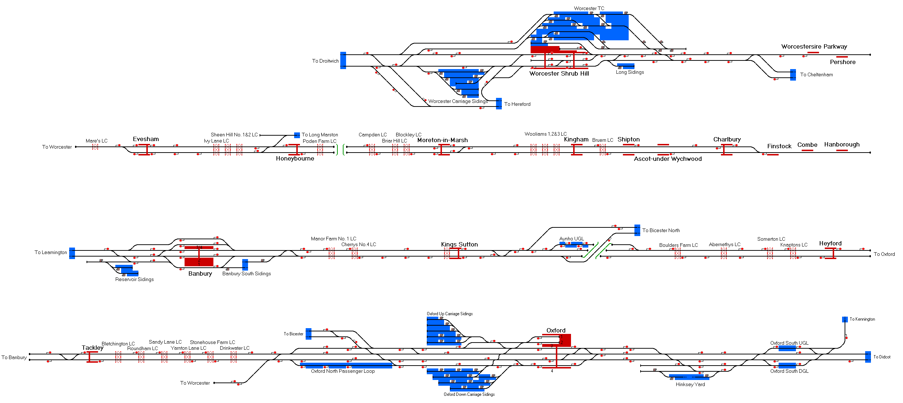

# Cotswolds Line
Representation of the modern day Cotswold Line from Oxford to Worcester

## Current Status

| Stage         | Status        |
| ------------- |:-------------:|
| Track Plan     | :heavy_check_mark: |
| Signalling      | :heavy_check_mark:      |
| Naming | :x:      |
| Speed Limits | :heavy_check_mark: |
| Distances | :x: |
| Timetable | :x: |
| Documentation | :x: |

## Data Sources

- A List of links pointing to various sources
- For example:
- [Carto Metro Paris Metro Map](http://carto.metro.free.fr/cartes/metro-paris/)
